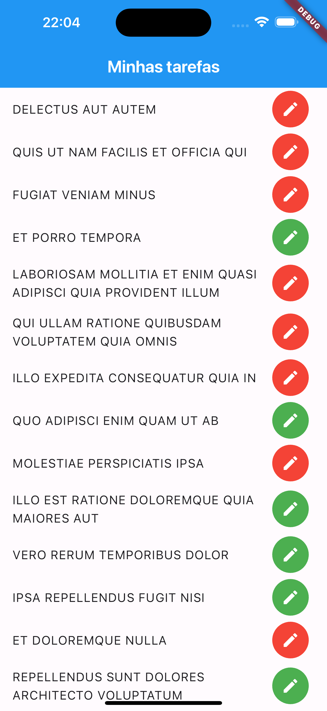

# Consumindo a API Todo

A construcao deste aplicativo visa apenas o aprendizado, erros podem ocorrer durante a execucao do mesmo.

No app, foi utilizado para gerenciamento de estado a lib flutter_bloc, utilizando as principais classes como Bloc e Cubit.

Para controle e injecao de dependencias foi utilizado a lib GetIt. 
## O que este App faz?

Esse App apenas consome uma API de Todo

## Referencia da API utilizada

#### Buscar todos os Todos (https://jsonplaceholder.typicode.com)

```http
  GET /todos
```

#### Buscar um unico Todo

```http
  GET /todo/${id}
```

| Parameter | Type     | Description                       |
| :-------- | :------- | :-------------------------------- |
| `id`      | `int` |  O id e **obrigatorio** para buscar. |


## Imagens do APP





## Tech Stack

**Client:** Dart, Flutter

**Server:** https://jsonplaceholder.typicode.com/todos/

